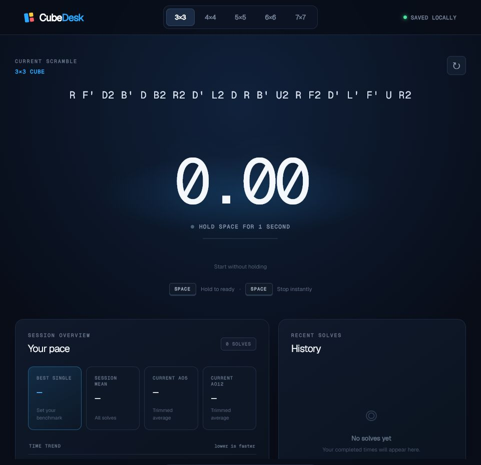
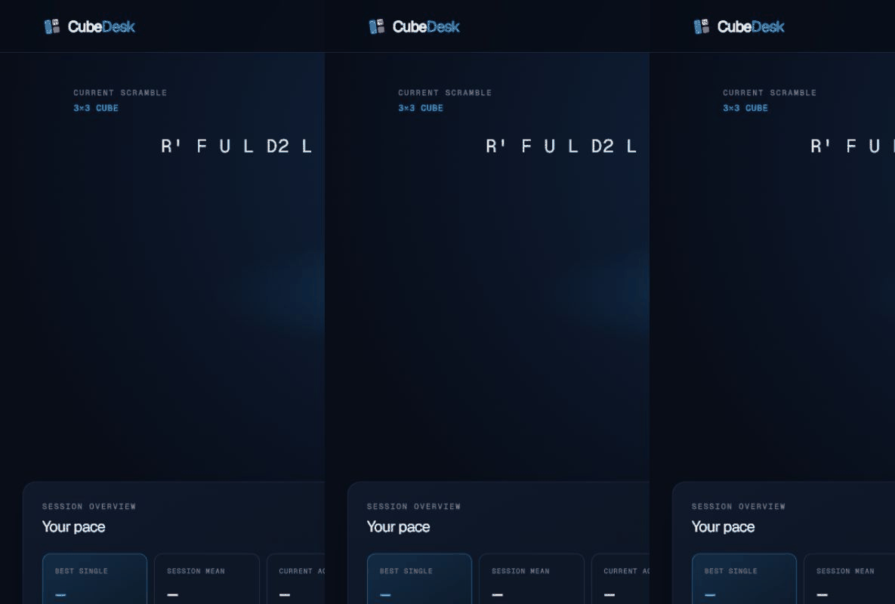
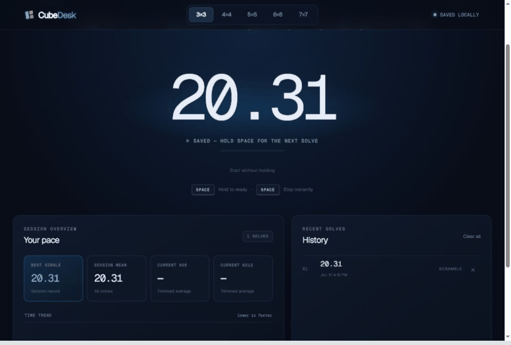

# CubeDesk



CubeDesk is a fast, private speedcubing timer that runs entirely in your browser. It generates scrambles for 3×3 through 7×7 cubes, records solves locally, calculates session statistics, and charts your progress without requiring an account or server.

## Timer demo



Hold Space for one second. When the timer turns green, release to start; press Space again to stop and save the solve.

## Features

- Size-aware scrambles for 3×3, 4×4, 5×5, 6×6, and 7×7
- Competition-inspired hold-to-arm keyboard flow
- Touch and pointer controls for phones and tablets
- Device-local solve history with no login or tracking
- Best single, session mean, trimmed Ao5, and trimmed Ao12
- Responsive trend graph for recent solves
- Per-event history, scramble details, deletion, undo, and clear-all
- Accessible instant-start control and live state announcements
- Resilient handling of malformed or unavailable browser storage



## Run locally

### Requirements

- Node.js 22.13 or newer
- npm

### Install and start

```bash
git clone https://github.com/mcgalliard/cubing-timer-codex.git
cd cubing-timer-codex
npm install
npm run dev
```

Open [http://localhost:3000](http://localhost:3000).

### Production build

```bash
npm run build
npm run start
```

## Controls

| Action | Keyboard | Touch / pointer |
| --- | --- | --- |
| Arm | Hold Space for one second | Hold the timer area for one second |
| Start | Release when the ready state turns green | Release when ready |
| Stop | Press Space once | Tap the timer area |
| Accessible start | Select **Start without holding** | Select **Start without holding** |

A short Space press does not start a solve. Space presses are ignored while a button or other control has focus, preventing accidental timer changes while navigating the interface.

## Local data

Solve history and the selected cube size are saved in browser `localStorage` under versioned CubeDesk keys. Each solve stores its cube size, raw time, scramble, stable ID, and creation time. Data never leaves the device.

Clearing site data for `localhost` also clears CubeDesk history. There is currently no cloud sync or cross-device account system.

## Development

```bash
npm test       # production build plus rendered-page test
npm run lint   # ESLint
npm run build  # deployment build
```

The main application is in `app/page.tsx`, styling is in `app/globals.css`, and scramble generation is isolated in `app/lib/scrambles.ts`. See [AGENTS.md](AGENTS.md) for architecture notes and guidance for future Codex sessions.

## Technology

- React 19
- Next.js-compatible app structure via vinext
- TypeScript
- Tailwind CSS pipeline with product-specific CSS
- Browser `localStorage` for private local persistence
- Inline SVG trend chart with an accessible text summary

## Privacy

CubeDesk has no analytics, advertisements, cookies, accounts, or network-backed solve storage. The only runtime data it writes is your history and selected event in the current browser.
